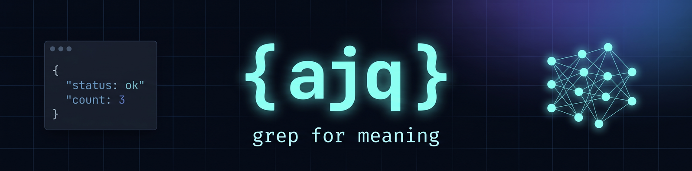

# ajq



`ajq` adds semantic matching and bounded classification to byte-deterministic
`jq` pipelines over JSON and NDJSON. For example,
`.[] | select(.message =~ "payment failure")` keeps records whose message
describes a payment failure even when the wording varies. The surrounding jq
selection and output remain deterministic, and model calls occur only for
explicit semantic operations, with scoring and normalization available only in
limited contexts.

## Choose the right tool

| Task | Use |
| --- | --- |
| Exact fields, regular expressions, structural transforms, or reproducible formatting | `jq` (or ajq with a pure jq query) |
| Find JSON/NDJSON records by topic, intent, or meaning | `ajq` with `=~` or `sem_match` |
| Route JSON/NDJSON records into labels you define up front | `ajq` with `sem_classify` |
| General-purpose extraction or redaction transforms | Choose a dedicated tool because ajq limits `sem_extract` and `sem_redact` to gated control-flow contexts |

Each semantic operation is visible in the query, and backend selection and call
limits remain under user control. Validate the query with the deterministic mock
backend, inspect its plan, and select a real backend with an explicit call cap
when the task needs model judgement.

## Usage

Start with `ajq --help`, then run `ajq examples` for categorized, copy-pasteable
safe workflows. Coding agents should first run `ajq capabilities --json` to
inspect the static machine-readable contract. `--backend mock` is the
deterministic, no-network, no-model path to exercise semantic query syntax
before selecting a real backend.

```bash
# Help and version
ajq --help
ajq --version

# Pure jq over JSON stays deterministic
printf '{"users":[{"name":"Ada"}]}' | ajq -r '.users[].name'
# Ada

# Semantic grep for JSON with the deterministic mock backend: safe agent probe
# (no model, network, or API key)
printf '[{"id":1,"msg":"please keep this"},{"id":2,"msg":"drop it"}]' \
  | ajq --backend mock -c '.[] | select(.msg =~ "keep") | .id'
# 1

# Inspect semantic plan and estimated backend calls before running an LLM-enhanced jq query
printf '[{"msg":"refund demanded"}]' \
  | ajq --backend mock --explain '.[] | select(.msg =~ "angry/frustrated") | .msg'
```

Run `ajq provision` once before using `--backend local`; then the same semantic queries can run against the managed local llama.cpp backend.

## Install

Use Homebrew, the release script for prebuilt archives, or Go source:

```bash
brew install --cask ricardocabral/tap/ajq
curl -fsSL https://raw.githubusercontent.com/ricardocabral/ajq/main/scripts/install.sh | sh
# manual download: https://github.com/ricardocabral/ajq/releases/latest
go install github.com/ricardocabral/ajq/cmd/ajq@latest
```

The Homebrew cask is published to the public `ricardocabral/tap` tap by the
release workflow.

### Coding-agent skill

Install the ajq routing skill for Codex from this repository's marketplace:

```bash
codex plugin marketplace add ricardocabral/ajq
codex plugin add ajq@ajq
```

The optional `npx plugins add ricardocabral/ajq` adapter currently targets
Claude Code and Cursor. See the [coding-agent skill installation
guide](https://ricardocabral.github.io/ajq/docs/how-to/install-agent-plugin/)
for pinned, workspace, CI, and verification flows.

## Status

| Area | What works today |
| --- | --- |
| Backends | Six semantic backends ship: `local`, `mock`, `ollama`, `openai`, `openrouter`, and Anthropic via `--cloud` / `--backend anthropic`. |
| Cost controls | `--explain` estimates model calls, `--max-calls` caps post-dedup judgements, and paid/cloud backends default to a 100-call guardrail. |
| Persistent cache | Semantic judgements are stored on disk under the ajq cache directory; `--no-cache` disables reads/writes for sensitive runs. |
| Local provisioning | `ajq provision` downloads or locates the llama.cpp engine and default GGUF model for `--backend local` on supported platforms. |
| Model management | `ajq models list`, `ajq models pull`, and `ajq models use` manage checksum-pinned local GGUF catalog models. |
| Semantic operators | Fuzzy matching (`=~` / `sem_match`) and bounded `sem_classify` ship for filters and labels; `sem_score` and `sem_norm` are limited to supported contexts. Standalone `sem_extract` and `sem_redact` are registered but currently unsupported. |
| Determinism contract | Pure jq paths stay byte-reproducible and never contact AI backends; only explicit semantic operators make schema-constrained, cache-keyed model calls by backend/model/spec/value. |

## Docs

Everything beyond the quick start lives on the website:

- [Install details](https://ricardocabral.github.io/ajq/docs/how-to/install/)
- [First pipeline tutorial](https://ricardocabral.github.io/ajq/docs/tutorials/first-pipeline/)
- [Filter JSON by meaning](https://ricardocabral.github.io/ajq/docs/how-to/filter-json-by-meaning/)
- [Classify JSON and NDJSON streams](https://ricardocabral.github.io/ajq/docs/how-to/classify-json-streams/)
- [Semantic functions reference](https://ricardocabral.github.io/ajq/docs/reference/semantic-functions/)
- [CLI reference](https://ricardocabral.github.io/ajq/docs/reference/cli/)
- [Split execution](https://ricardocabral.github.io/ajq/docs/explanation/split-execution/) and [determinism](https://ricardocabral.github.io/ajq/docs/explanation/determinism/)

## Contributor verification

```bash
make test
make build
make website-build
```

## License

MIT. See [LICENSE](LICENSE).

This project uses [gojq](https://github.com/itchyny/gojq), an implementation of jq in Go.
